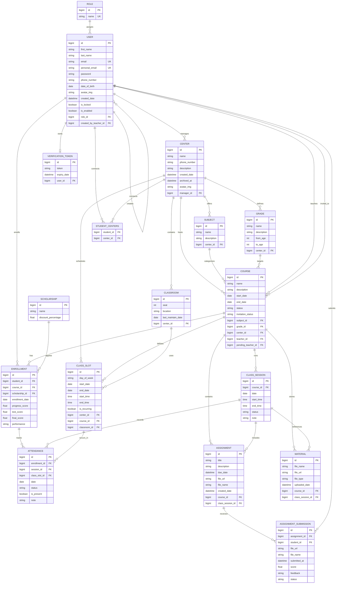

# Project Entity Relationship Diagram

This diagram is based on the JPA entities in the backend module.

Notes:

- `Enrollment` is the junction entity between `User` in the student role and `Course`, and it also stores scores and scholarship usage.
- `student_centers` is the join table behind the many-to-many relationship between students and centers.
- `ClassSlot` is the recurring schedule rule, while `ClassSession` is a concrete lesson instance on a specific date.
- `Attendance` links an enrolled student to either a generated `ClassSession`, a `ClassSlot`, or both depending on workflow.
- `ClassSlot` also has element-collection support tables for recurring weekdays and excluded dates: `class_slot_days` and `class_slot_excluded_dates`. They are not modeled as standalone entities here.
*** End Patch